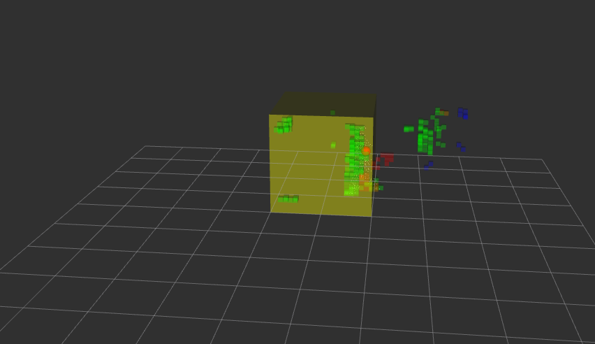

# ある特定のエリアに人間が入ったことを検出するシステム

## 概要

このシステムは、指定されたエリアに人間が侵入した際に検出を行う安全監視システムです。ROS2（Humble）を基盤として構築されており、リアルタイムでの人間検出を可能にします。

## アルゴリズム

1. 点群データをボクセル化し、空間を規則的に分割
2. ボクセルをクラスタリングし、人間を識別
3. クラスタの位置（重心）を追跡し、その動きを監視

    クラスタCを構成する点群 $\{(x_j, y_j, z_j)\}_{j=1}^{N_c}$ が得られると、重心は以下で求まる

$$
\begin{aligned}
\bar{x} &= \frac{1}{N_c} \sum_{j=1}^{N_c} x_j \\
\bar{y} &= \frac{1}{N_c} \sum_{j=1}^{N_c} y_j \\
\bar{z} &= \frac{1}{N_c} \sum_{j=1}^{N_c} z_j
\end{aligned}
$$

5. 人物が指定された領域に入ったことを検出

## 実行環境

- **OS:** Ubuntu 22.04
- **ROS2ディストリビューション:** Humble

## インストール手順

1. **ワークスペースのセットアップ**

    ```bash
    mkdir -p ~/hoge_ws/src
    cd ~/hoge_ws/src
    ```

2. **リポジトリのクローン**

    ```bash
    git clone git@github.com:RyoFunai/safety_monitoring_system.git
    ```

3. **依存関係のインストール**

    ```bash
    cd ~/hoge_ws
    ```

4. **ビルド**

    ```bash
    colcon build
    ```

## 使用方法

システムを実行するための手順は以下の通りです。

1. **システムの起動**

    ```bash
    source hoge_ws/install/setup.bash
    ros2 run safety_monitoring_system safety_monitoring_system
    ```

2. **データの再生**

    ```bash
    ros2 bag play rosbag2_2024_12_20-16_15_26
    ```

3. **RVizの起動**

    ```bash
    rviz2 -d hoge_ws/src/safety_monitoring_system/rviz/safety_monitoring_system.rviz
    ```

## 使用例

rviz2で以下のように表示されます。
人が指定されたエリアに入ると、ターミナルから`侵入しています`という出力が得られます。


